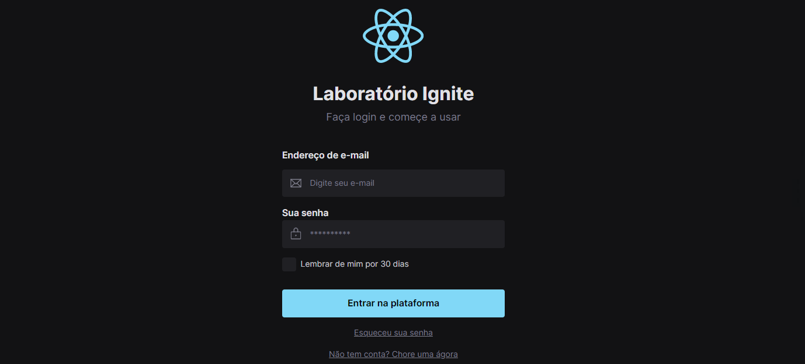
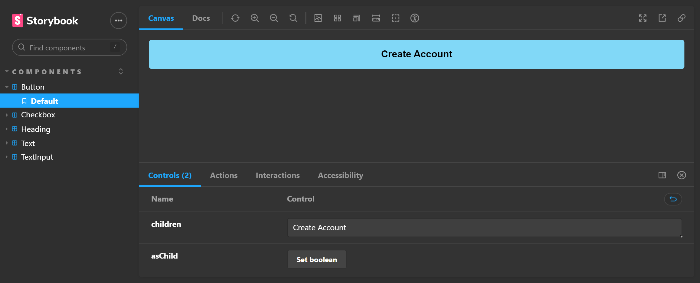

# IGNITE-LAB: DESIGN SYSTEM
Projeto onde fomos apresentados a metodologia de Design System. Produzimos um layout através do Figma e posteriormente passamos os componentes para a ferramenta Storybook, montamos a página utilizando a biblioteca React em Typescript e estilizamos com o framework Tailwind. 

> Layout desenvolvido pelo FIGMA

--------------------------------------------------------------------------------------

> A ferramenta Storybook com os componentes inseridos.
[Clique aqui para acessar](https://luanc14.github.io/Ignite-Lab-Design-System/)

## Tecnologias:
- Figma
- Typescript
- React
- Storybook
- Tailwind

## Contato:
- +55 (74)991992796
- luanchr14@gmail.com
